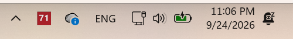
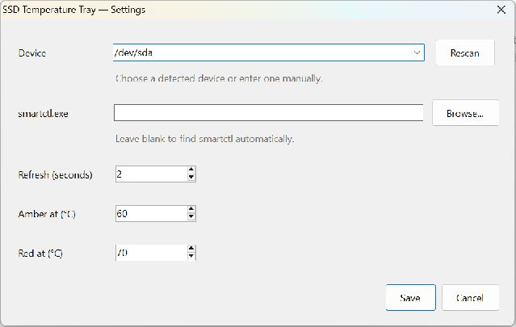

# Drive Temperature Tray

A small Windows system tray app that displays your drive's current temperature **as a number in the tray icon**, refreshing every **2 seconds** by default.

It is a graphical companion to `smartctl -A /dev/sda`: no console window, no background service, and no network requests from the app.

## Why this exists

Poor ventilation can make a laptop run hot—for example, when its air vents are blocked by a soft surface. As components heat up, they may throttle performance to protect themselves, sometimes causing severe slowdowns. An overheating SSD can reduce its transfer speeds substantially.

Drive Temperature Tray keeps the selected drive's temperature visible in real time, so you can notice rising temperatures and see how they change when you improve ventilation or reduce the workload. It monitors the **drive itself**, not CPU temperature or the whole laptop; temperature alone does not prove the cause of a slowdown. Supported HDDs work too.



## Features

- Numeric Celsius icon, with exact temperature and reading time in the tooltip.
- Detected-device dropdown with Rescan and manual entry; configurable refresh interval, smartctl path, and icon color thresholds.
- Blue below 60°C, amber from 60°C, red from 70°C by default. These are display preferences, not manufacturer health limits.
- A gray `--` on errors; double-click for details. Failed reads never leave an old temperature displayed as current.
- Optional automatic startup at Windows sign-in, including after a reboot.
- One instance per Windows session, hidden smartctl processes, non-overlapping reads, and a five-second command timeout.
- Per-user installer, Start menu shortcut, and Windows uninstall support.

## Requirements

- Windows 10 or 11 with .NET Framework 4.8 or newer (already included in Windows 11).
- [smartmontools](https://www.smartmontools.org/) 7.x, installed separately. The installer does not bundle or download it.
- A drive that exposes its temperature through smartctl. The default device is `/dev/sda`.

The app searches the standard `Program Files\smartmontools\bin` locations and then `PATH`. You can also select `smartctl.exe` in Settings. Depending on the drive and controller, smartctl may require administrator privileges. The app runs with your normal permissions and does not automatically elevate.

## Install and use

1. Install smartmontools if needed and confirm that it can read your drive:
   ```powershell
   & 'C:\Program Files\smartmontools\bin\smartctl.exe' -j -A /dev/sda
   ```
2. Download and run [DriveTemperatureTray-Setup-1.0.4.exe](https://github.com/rodrigodesalvobraz/drive-temperature-tray/releases/download/v1.0.4/DriveTemperatureTray-Setup-1.0.4.exe), or build the installer locally.
3. Leave **Start automatically when I sign in to Windows** selected.
4. Launch the app. Hover over its tray number for the temperature and last reading time. Double-click for details; right-click for Settings, refresh, startup, or Exit.

Windows may initially put the icon in the tray overflow (`^`). Drag it onto the taskbar notification area, or enable it in Windows taskbar settings.

The installer uses `%LOCALAPPDATA%\Programs\DriveTemperatureTray` and adds a quoted executable path to `HKCU\Software\Microsoft\Windows\CurrentVersion\Run` under `DriveTemperatureTray`. Startup occurs when your desktop session begins, not before sign-in. Windows Task Manager's Startup apps settings can separately disable it.

Upgrading from **SSD Temperature Tray** updates the same installation, replaces the old startup entry and shortcuts, and imports your existing settings. An existing installation keeps its previous installation folder; new installations use the folder above.

To uninstall, use **Settings → Apps → Installed apps → Drive Temperature Tray**, or the Start menu uninstall shortcut. The startup entry is removed. Personal settings and the most recent diagnostic reading are retained in `%LOCALAPPDATA%\DriveTemperatureTray`; delete that folder manually if you no longer want them.

## Configuration and troubleshooting

Right-click the tray icon and choose **Settings**.



| Option | What it does |
| --- | --- |
| **Device** | Select a drive found by smartctl, or type a device name such as `/dev/sda`. Only the selected drive is monitored. |
| **Rescan** | Refresh the device list, for example after connecting a drive. |
| **smartctl.exe** | Leave blank to find smartctl automatically, or enter its full executable path. |
| **Browse...** | Locate `smartctl.exe` using a file picker. |
| **Refresh (seconds)** | Set how often to read the temperature, from 1 to 3600 seconds. The default is 2. |
| **Amber at (°C)** | Change the icon from blue to amber at this temperature; default 60°C. |
| **Red at (°C)** | Change the icon to red at this temperature; default 70°C. Must be higher than the amber threshold. |
| **Save** | Validate, save, and apply your changes, then close Settings. |
| **Cancel / Esc** | Close Settings and discard unsaved changes. Monitoring continues with the previous settings. |

Color thresholds are visual cues, not the drive manufacturer's thermal limits, and they do not control cooling or throttling. The tray menu also provides **Start when I sign in**, **Refresh now**, **Details**, and **Exit**. Exit stops monitoring until you launch the app again or sign in with startup enabled.

Settings are stored in `%LOCALAPPDATA%\DriveTemperatureTray\settings.json`:

```json
{
  "Device": "/dev/sda",
  "SmartctlPath": "",
  "IntervalSeconds": 2,
  "WarmCelsius": 60,
  "HotCelsius": 70
}
```

Close the app before editing this file manually. A blank executable path enables auto-detection. Invalid settings cause the app to use defaults and show a notification; the invalid file is preserved until you save Settings.

If the tray shows `--`, double-click it for the error, verify the device with `smartctl --scan`, and try the command above in PowerShell. A USB bridge or RAID controller may not expose temperature; custom smartctl device-type arguments are not currently supported. Higher smartctl exit-status bits can indicate drive health/history warnings even when a temperature is available: this app is a temperature display, not a complete SMART health monitor.

The latest read result is replaced in `status.json` beside the settings file. It contains the temperature, UTC timestamp, error (if any), and smartctl exit code; it is not an accumulating log. The timestamp uses the .NET JSON `/Date(milliseconds-since-epoch)/` representation. A one-shot diagnostic is also available:

```powershell
$app = "$env:LOCALAPPDATA\Programs\DriveTemperatureTray\DriveTemperatureTray.exe"
$report = "$env:TEMP\drive-temperature-probe.json"
Start-Process -FilePath $app -ArgumentList "--probe `"$report`"" -Wait
Get-Content $report
```

## Build from source

The app uses Windows Forms and the .NET Framework compiler included with Windows. No NuGet packages or .NET SDK are needed.

```powershell
powershell -NoProfile -ExecutionPolicy Bypass -File .\scripts\build.ps1
powershell -NoProfile -ExecutionPolicy Bypass -File .\scripts\test.ps1
```

Output: `build\DriveTemperatureTray.exe` and its `.config` file. Keep them together.

For the Windows installer, install [Inno Setup 6](https://jrsoftware.org/isdl.php), then run:

```powershell
powershell -NoProfile -ExecutionPolicy Bypass -File .\scripts\build.ps1 -Installer
# Or specify a compiler location:
powershell -NoProfile -ExecutionPolicy Bypass -File .\scripts\build.ps1 -Installer -IsccPath 'C:\path\to\ISCC.exe'
```

Output: `dist\DriveTemperatureTray-Setup-1.0.4.exe`; the build prints its SHA-256 hash. The installer and app are currently unsigned. Build outputs are intentionally excluded from Git; installers and checksums are available on [GitHub Releases](https://github.com/rodrigodesalvobraz/drive-temperature-tray/releases).

Unattended installation (launch the app separately afterwards):

```powershell
Start-Process .\dist\DriveTemperatureTray-Setup-1.0.4.exe -ArgumentList '/VERYSILENT /SUPPRESSMSGBOXES /NORESTART /TASKS="startup"' -Wait
```

## Project layout

| Path | Purpose |
| --- | --- |
| `src/` | Tray UI, asynchronous smartctl reader, configuration, and manifest |
| `installer/setup.iss` | Per-user installer and startup registration |
| `scripts/build.ps1` | Compile app and optionally installer |
| `scripts/test.ps1` | Build and run parser, validation, icon, and process tests |
| `tests/` | Tests independent of a physical drive |

The reader consumes smartctl's unified `temperature.current` JSON field, shared by supported NVMe and ATA devices. It redirects both process streams, enforces a timeout, and updates the UI asynchronously. Each replacement icon releases its native handle.

Before publishing a release, run the tests, probe a real drive, confirm the tray updates, and check install/uninstall and sign-in startup on the target Windows version.
